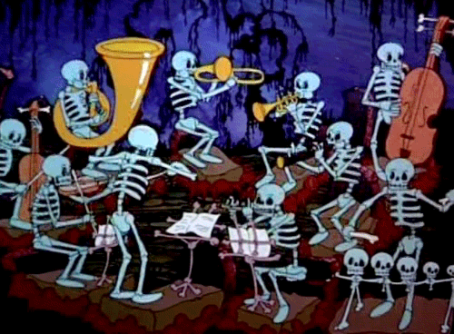

When I'm not pushing to finish up my Masters of Science in Data Science, working full time as a Full Stack Engineer or parenting, I like writing fun, useful, simple software. My time is limited, but I'll try to push some simple projects out that may be useful.

Over the years GitHub allowed me to contribute to some pretty cool projects. I hope it offers the same opportunity to you.

Let's connect, collaborate, and create together to build a better digital world!
 - LinkedIn account: [https://www.linkedin.com/in/timbrockman/](https://www.linkedin.com/in/timbrockman/)
 - Website: [TimBrockman.com](https://timbrockman.com) : the repo is [here](https://github.com/timBrockman/timbrockman.com) 

Here's a dancing skeleton band:

